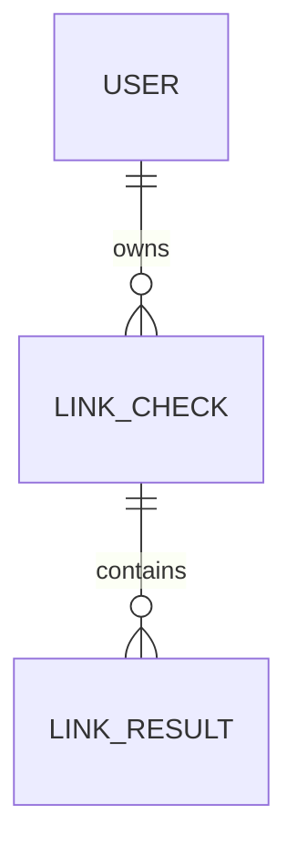

# Hidden Link Checker - Domain Model

## 1. Phạm vi MVP

MVP nhận một URL, lấy DOM của chính URL đầu vào, tìm hidden link,
sau đó lưu kết quả theo user đăng nhập bằng Google. Mọi URL được phát hiện đều
là hidden link; link hiển thị trực tiếp chỉ là một subtype có visibility `direct`.
MVP không đánh giá rủi ro,
không dùng severity/rule và không mở hoặc request tới các link được phát hiện.

## 2. Quan hệ domain

## 3. Entity

### User

Đại diện tài khoản nội bộ liên kết với Google OAuth/OIDC.

Fields chính: `id`, `google_subject`, `email`, `status`, `created_at`,
`last_login_at`.

`google_subject` chỉ dùng nội bộ để liên kết identity, không trả qua public API.
Mọi dữ liệu kiểm tra phải được truy vấn theo authenticated `user_id`.

### LinkCheck

Đại diện một lần kiểm tra một URL.

Fields chính: `id`, `user_id`, `submitted_url`, `normalized_url`, `final_url`,
`status`, `http_status`, `error_code`, `dom_reference`, `created_at`,
`completed_at`, `retention_expires_at`.

Một `LinkCheck` chỉ fetch/render URL đầu vào. Redirect chỉ được xử lý để hoàn
tất việc lấy DOM của URL đầu vào và phải qua SSRF policy.

### LinkResult

Đại diện một link được phát hiện trong DOM.

Fields chính: `id`, `link_check_id`, `element_type`, `object_reference`,
`source_url`, `actual_url`, `visibility`, `visible_text`, `alt_text`, `position`.

- `element_type`: `text`, `image` hoặc `background`.
- `visibility = direct`: hidden link hiển thị trực tiếp, ví dụ anchor có text.
- `visibility = indirect`: hidden link nằm sau image, background hoặc object
  không hiển thị như link trực tiếp.
- `source_url`: URL literal đọc được từ DOM.
- `actual_url`: URL sau khi resolve theo final URL của trang đầu vào.
- `position`: bounding box nếu lấy được, có thể `null`.

`actual_url` chỉ là dữ liệu kết quả. System không fetch, mở, redirect hoặc
điều hướng tới `actual_url` trong MVP.

## 4. Invariants và ownership

1. Mỗi `LinkCheck` thuộc đúng một `User`.
2. Mỗi `LinkResult` thuộc đúng một `LinkCheck` và kế thừa ownership của user.
3. Client không được tự gửi `user_id`; server lấy từ Google-authenticated user.
4. API phải lọc ownership trước mọi thao tác đọc, cập nhật hoặc xóa.
5. Xóa `LinkCheck` phải xử lý các `LinkResult` liên quan theo retention policy.
6. Không lưu hoặc log OAuth secret, token, raw query string nhạy cảm hoặc
   nội dung DOM vượt quá policy lưu trữ.

## 5. PostgreSQL mapping

PostgreSQL là database production chính. Dùng foreign key từ `link_checks.user_id`
đến `users.id` và từ `link_results.link_check_id` đến `link_checks.id`, cùng
transaction khi lưu một lần kiểm tra và toàn bộ kết quả.

Index tối thiểu:

- `users.google_subject` unique;
- `link_checks.user_id, created_at` cho lịch sử;
- `link_results.link_check_id` cho chi tiết kết quả;
- `link_results.visibility` nếu dashboard cần lọc direct/indirect.

DOM lớn nên lưu ngoài database và chỉ lưu reference; metadata có cấu trúc linh
hoạt có thể dùng JSONB khi cần.
