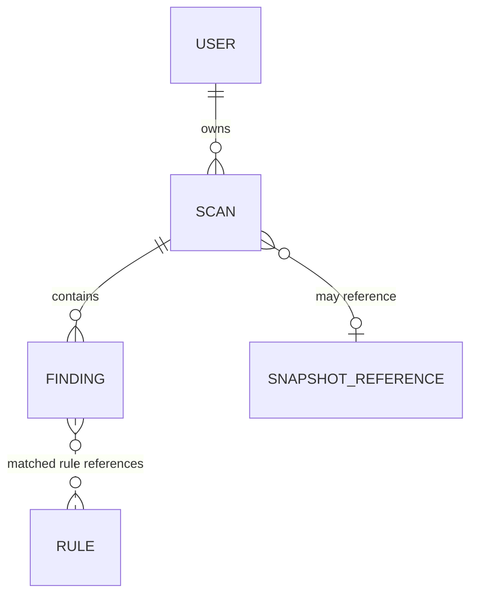
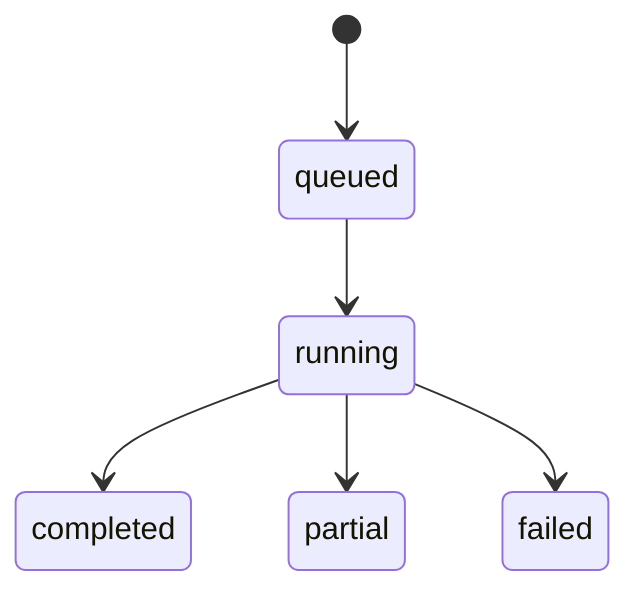

# Hidden Link Checker — Domain Model

## 1. Mục đích và phạm vi

Tài liệu này mô tả các khái niệm nghiệp vụ, quan hệ và invariant của Hidden Link Checker MVP. Đây là domain model, không phải schema database hay bản sao của API request/response.

MVP nhận một URL cho mỗi scan, phân tích các URL đọc được trong `text`, `image` và `background`, đánh giá bằng rule có thể giải thích, rồi lưu kết quả theo user. Sản phẩm hỗ trợ review tín hiệu; không kết luận malware/phishing và không chứng nhận website an toàn.

Các nội dung được ghi là **Đã xác nhận** xuất phát từ `docs/recommendation.md`, `docs/br-analysis.md`, `docs/specification.md`, `docs/api-spec.md` hoặc `docs/context-engineering.md`. Nội dung chưa được các tài liệu quyết định được đánh dấu `[DECISION REQUIRED]`.

## 2. Quan hệ domain

`RULE` trong sơ đồ là khái niệm cấu hình logic. Tài liệu hiện chưa xác nhận rule được lưu như entity trong database hay có quan hệ khóa ngoại với `FINDING`. `SNAPSHOT_REFERENCE` biểu diễn tham chiếu tới artifact; nội dung và cách cấp quyền tải snapshot chưa được chốt.

## 3. Entity

### 3.1 User

**Trách nhiệm:** đại diện tài khoản sở hữu các scan và dữ liệu liên quan.

| Thuộc tính | Ý nghĩa | Trạng thái |
|---|---|---|
| `id` | Định danh user | Đã xác nhận; format chưa chốt |
| `email` | Email dùng để đăng ký/đăng nhập | Đã xác nhận; normalization và uniqueness chưa chốt |
| `password_hash` | Hash của password; chỉ dùng nội bộ, không trả qua API | Đã xác nhận |
| `status` | Trạng thái tài khoản | Field đã xác nhận; miền giá trị ngoài ví dụ `active` chưa chốt |
| `created_at` | Thời điểm tạo tài khoản | Đã xác nhận; API quy định timestamp ISO 8601 UTC |
| `last_login_at` | Thời điểm đăng nhập gần nhất | Đã xác nhận; có thể `null` nếu chưa có giá trị |

**Quan hệ:** một `User` sở hữu không hoặc nhiều `Scan`; mỗi `Scan` thuộc đúng một user đã xác thực tạo scan đó.

**Invariant và bảo mật:**

- Không lưu hoặc log password dạng rõ; không đưa `password_hash` vào public user object.
- Client không được gán `user_id` cho thao tác scan; ownership lấy từ user đã xác thực.
- Mọi thao tác đọc/xóa scan, finding và snapshot phải giới hạn theo owner.

**[DECISION REQUIRED]** Email có duy nhất sau normalization không? `status` có những giá trị nào và trạng thái nào được phép đăng nhập? Có quy trình xóa/đóng tài khoản không?

### 3.2 Scan

**Trách nhiệm:** đại diện một lần yêu cầu phân tích một trang, từ lúc được nhận tới khi worker kết thúc và kết quả được lưu.

| Thuộc tính | Ý nghĩa | Trạng thái |
|---|---|---|
| `id` | Định danh scan | Đã xác nhận; format chưa chốt |
| `user_id` | Owner tạo scan | Đã xác nhận trong data model; lấy từ authenticated user |
| `submitted_url` | URL do user gửi | Đã xác nhận |
| `normalized_url` | URL của trang sau bước chuẩn hóa ban đầu | Có trong data model/API; quy tắc chuẩn hóa chính xác chưa chốt |
| `final_url` | URL cuối cùng sau navigation/redirect | Đã xác nhận; có thể `null` trước khi có kết quả |
| `status` | Trạng thái lifecycle | Miền giá trị đã xác nhận ở mục 5 |
| `http_status` | HTTP status thu được từ trang, nếu có | Đã xác nhận; có thể chưa có trước kết quả |
| `error_code` | Mã lỗi có kiểm soát, không phải stack trace | Đã xác nhận; danh sách mã chưa chốt |
| `snapshot_reference` | Tham chiếu snapshot nếu snapshot được tạo | Đã xác nhận; có thể không có; cách truy cập chưa chốt |
| `safe_count` | Số finding `safe` | Đã xác nhận; cách biểu diễn khi chưa terminal chưa chốt |
| `warning_count` | Số finding `warning` | Đã xác nhận; cách biểu diễn khi chưa terminal chưa chốt |
| `critical_count` | Số finding `critical` | Đã xác nhận; cách biểu diễn khi chưa terminal chưa chốt |
| `created_at` | Thời điểm tạo scan | Đã xác nhận; ISO 8601 UTC ở API |
| `completed_at` | Thời điểm kết thúc xử lý | Đã xác nhận; `null` khi chưa hoàn tất |
| `retention_expires_at` | Thời điểm hết hạn lưu dữ liệu | Đã xác nhận trong API; policy và thời hạn chưa chốt |
| `limitations` | Giới hạn khiến kết quả không đầy đủ | Có trong API contract; chưa có trong data model specification |

Request `include_snapshot` là lựa chọn khi tạo scan. Chưa xác nhận có cần lưu lựa chọn này thành thuộc tính lâu dài của `Scan` hay không.

**Quan hệ:** một `Scan` thuộc một `User`, có không hoặc nhiều `Finding`, và có thể có một `SnapshotReference`.

**Invariant:**

- Mỗi scan chỉ đại diện một URL/trang; không dùng scan để mô hình hóa crawler nhiều trang.
- Scan được tạo bởi user xác thực; quyền truy cập không suy ra chỉ từ việc biết `scan_id`.
- Finding, snapshot và counts được trả cho scan phải thuộc chính scan đó.
- `completed` biểu thị xử lý xong trong phạm vi dự kiến; `partial` biểu thị có kết quả nhưng có giới hạn; `failed` biểu thị không tạo được kết quả usable.
- `error_code` là mã ổn định/có kiểm soát, không chứa stack trace hay chi tiết nội bộ.

**[DECISION REQUIRED]** Cần chốt `limitations` có được lưu trên entity Scan và cấu trúc từng limitation; semantics counts khi scan chưa terminal; snapshot opt-in/default; thời hạn retention; hard delete hay soft delete; và việc user có thể xóa scan đang queued/running hay không.

### 3.3 Finding

**Trách nhiệm:** một URL được phát hiện từ một element trong trang đã scan, kèm ngữ cảnh đủ để người dùng đối chiếu destination và lý do phân loại.

| Thuộc tính | Ý nghĩa | Trạng thái |
|---|---|---|
| `id` | Định danh finding | Đã xác nhận trong API; format chưa chốt |
| `scan_id` | Scan chứa finding | Đã xác nhận |
| `element_type` | Nhóm element nguồn | `text`, `image`, `background` |
| `source_url` | Giá trị URL đọc được từ element | Đã xác nhận; giữ riêng với URL đã resolve |
| `normalized_url` | URL đã resolve theo final page URL | Đã xác nhận |
| `visible_text` | Text hiển thị liên quan | Có thể rỗng nếu không thu thập được |
| `alt_text` | Alt text liên quan | Có thể rỗng nếu không thu thập được |
| `matched_content` | Nội dung được dùng làm bằng chứng rule | Có thể rỗng nếu không thu thập được |
| `position` | Bounding box `{x, y, width, height}` | Có thể `null` nếu element không render/không lấy được vị trí |
| `severity` | Mức ưu tiên review | Chính xác một trong `safe`, `warning`, `critical` |
| `matched_rules` | Tên các rule khớp | Danh sách; `[]` khi không rule nào khớp |

**Quan hệ:** mỗi finding thuộc đúng một scan. Scan cung cấp user ownership gián tiếp; API phải xác thực quyền ở cấp scan trước khi trả findings.

**Invariant:**

- `normalized_url` được resolve theo URL cuối cùng của trang, không theo URL ban đầu nếu trang đã redirect.
- Giữ `source_url` để so sánh với kết quả chuẩn hóa.
- `safe` nghĩa là chưa có rule rủi ro nào khớp trong phạm vi scan; `matched_rules` rỗng.
- Finding không được xem là verdict malware/phishing.
- Severity khác `safe` phải có rule và evidence có thể giải thích theo specification.

**[DECISION REQUIRED]** API hiện chỉ biểu diễn `matched_rules` bằng tên rule và evidence bằng các field nội dung của finding; chưa định nghĩa object giải thích gồm rule name, reason, matched value/field hay rule version. Cần thống nhất model/API để mọi severity khác `safe` thực sự có evidence trình bày được. Cũng cần chốt tính duy nhất/khử trùng lặp finding khi cùng URL xuất hiện ở nhiều element.

### 3.4 Rule

**Trách nhiệm:** một cấu hình đánh giá có tên ổn định, điều kiện match, severity và lý do hiển thị; rule evaluator áp dụng các rule lên finding.

**Đã xác nhận về hành vi:**

- Rule được cấu hình tập trung và mở rộng được mà không phải sửa extractor cốt lõi.
- `gambling-keyword` có thể tạo `critical` khi keyword cấu hình xuất hiện trong URL hoặc nội dung finding.
- Destination ngoài origin ít nhất tạo `warning` nếu không có rule severity cao hơn.
- Nếu nhiều rule khớp, kết quả phải phản ánh severity phù hợp và nêu các rule khớp; thứ tự ưu tiên cụ thể cần nhất quán giữa evaluator và contract.
- Rule phải có giải thích; rule không kết luận malware/phishing.

**Mô hình hóa:** `Rule` hiện là khái niệm cấu hình, chưa được xác nhận là entity persisted. `matched_rules` trong Finding/API là danh sách tên rule, chưa phải liên kết tới record Rule.

**[DECISION REQUIRED]** Chốt schema rule (ví dụ `name`, `severity`, `condition`, `reason`), nơi lưu và ai quản trị; versioning; rule active/effective theo thời điểm nào; severity precedence; và có cần lưu rule version/evidence tại thời điểm scan để kết quả lịch sử có thể tái giải thích hay không.

## 4. Value object và miền giá trị

| Khái niệm | Miền/ý nghĩa | Invariant |
|---|---|---|
| `ElementType` | `text`, `image`, `background` | Chỉ các nhóm này trong MVP |
| `Severity` | `safe`, `warning`, `critical` | Mỗi finding có đúng một severity |
| `ScanStatus` | `queued`, `running`, `completed`, `partial`, `failed` | Ý nghĩa trạng thái ở mục 5 |
| `Position` | `x`, `y`, `width`, `height` | Toàn object có thể `null`; kiểu số/đơn vị/viewport chưa chốt |
| `SourceUrl` | URL literal đọc được từ element | Không thay thế `NormalizedUrl` |
| `NormalizedUrl` | Destination URL sau resolve/normalization | URL tương đối dùng final page URL làm base |
| `SnapshotReference` | Tham chiếu nội bộ tới snapshot | Không tiết lộ storage credential hoặc path nội bộ |
| `MatchedRuleReference` | Tên rule có trong `matched_rules` | `[]` khi safe; nội dung explanation chi tiết chưa chốt |
| `RetentionExpiry` | Thời điểm hết hạn lưu | Thời hạn cụ thể chưa chốt |

URL scan đầu vào chỉ chấp nhận scheme `http`/`https`; việc kiểm tra SSRF đầy đủ thuộc URL policy/worker, không phải invariant chỉ dựa vào việc parse scheme.

## 5. Scan lifecycle và chuyển trạng thái

Các trạng thái và ý nghĩa được xác nhận trong specification/API contract:

- `queued`: request được nhận và chờ worker.
- `running`: worker đang xử lý.
- `completed`: xử lý xong trong phạm vi dự kiến.
- `partial`: có kết quả usable nhưng một phần nội dung không đọc được hoặc bị giới hạn; cần ghi limitation.
- `failed`: không tạo được kết quả usable do validation, network hoặc worker failure.

Sơ đồ chỉ thể hiện các chuyển tiếp được tài liệu nêu. Không có trạng thái `cancelled` hoặc chuyển tiếp retry đã được chốt. Quy tắc retry nội bộ không được làm scan terminal trông như đã hoàn tất.

**[DECISION REQUIRED]** Chốt có cho phép xóa/cancel scan trước khi hoàn thành không; retry worker có tạo attempt mới hay giữ nguyên scan; và xử lý race condition nếu delete xảy ra trong lúc worker đang chạy.

## 6. Invariant và business rules tổng hợp

1. `Scan` có đúng một owner `User`; `Finding` thuộc đúng một `Scan`.
2. Tất cả query/API truy cập scan, finding hoặc snapshot phải enforce ownership từ authenticated user.
3. `Finding.severity` chỉ nhận một giá trị trong enum. `safe` có `matched_rules = []`; severity khác `safe` cần rule/evidence giải thích.
4. Keyword gambling cấu hình được, khi match URL/nội dung liên quan sẽ kích hoạt `critical` và ghi `gambling-keyword` theo acceptance criteria.
5. Destination ngoài origin không có tín hiệu nghiêm trọng hơn phải ít nhất là `warning`.
6. URL tương đối của finding được chuẩn hóa theo final page URL; nguồn và destination sau chuẩn hóa được lưu riêng.
7. `partial` không đồng nghĩa `failed`; kết quả partial phải giữ findings usable và nêu giới hạn.
8. Không truy cập URL đích trước khi policy SSRF cho phép. Worker kiểm tra DNS/IP và kiểm tra lại sau mỗi redirect; giới hạn resource phải được áp dụng.
9. Không gửi cookie, authorization header hoặc secret ứng dụng tới destination; không log password/secret hoặc raw query string nhạy cảm.
10. Xóa scan phải xử lý findings và snapshot liên quan theo retention policy; không được để user khác truy cập dữ liệu đã xóa hoặc hết hạn.

## 7. Ownership, retention, deletion và privacy

- Owner của scan là authenticated user tại thời điểm tạo; request không được tự chọn owner bằng `user_id`.
- Findings được phân quyền qua scan cha. Snapshot/reference cũng phải có cùng ownership boundary.
- Recommendation yêu cầu scan, snapshot và URL thuộc tài khoản tạo ra; specification yêu cầu xóa scan cùng findings/snapshot hoặc đánh dấu xóa theo retention policy.
- Password chỉ tồn tại dưới dạng hash trong persistence; public user object không bao gồm `password_hash`.
- Hạn chế lưu/log query string nhạy cảm. Snapshot, URL và finding chịu retention policy; thời hạn chưa được quyết định.
- `retention_expires_at` là metadata của scan/API; cơ chế purge, thứ tự xóa artifact và xác nhận xóa chưa được chốt.

## 8. Mapping tới requirement

| Domain concept/rule | Requirement liên quan | Mức bao phủ |
|---|---|---|
| `User`, credential, profile | BR-001, FR-001, AC-01 | Entity fields cơ bản có; email/password policy, account status và auth lifecycle còn mở |
| `Scan` tạo bất đồng bộ | BR-002, FR-002 | URL HTTP(S), owner và `queued` được xác nhận |
| URL policy/navigation | BR-009, FR-003, AC-05 | SSRF/DNS/redirect/resource constraints được xác nhận; cấu hình giới hạn cụ thể còn mở |
| `Finding`, `ElementType`, URL normalization, `Position` | BR-003/004, FR-004/005, AC-02 | Ba loại element, source/normalized URL và nullable position được mô tả |
| `Rule`, `Severity`, matched rule/evidence | BR-005/006, FR-006, AC-02 | Severity và gambling/external destination behavior được xác nhận; model evidence/version còn mở |
| Snapshot, counts, limitations | BR-007/011, FR-007/008, AC-03/06 | API có snapshot reference/counts/limitations; persistence của limitation và quyền tải snapshot cần đồng bộ |
| Ownership và deletion | BR-008, FR-009, AC-04 | Owner scoping và xóa dữ liệu liên quan được xác nhận; semantics xóa và retention duration còn mở |
| Rule extensibility | BR-012 | Cấu hình tập trung được yêu cầu; quản trị/versioning chưa chốt và không có API admin trong MVP |

## 9. Mâu thuẫn và quyết định cần chốt

1. **Evidence giải thích rule:** recommendation/specification yêu cầu lý do/evidence; API `matched_rules` hiện chỉ là tên rule cùng các field nội dung Finding. Chốt shape của explanation và nguồn evidence.
2. **Warning do dữ liệu thiếu:** `warning` có thể được gán khi dữ liệu thiếu, trong khi mọi severity khác `safe` phải có rule/evidence. Chốt rule cụ thể và evidence nào tạo warning này.
3. **Limitations:** API contract có `limitations`, nhưng data model specification chưa liệt kê field này. Chốt field và kiểu dữ liệu domain.
4. **Snapshot:** API có `snapshot_reference`, nhưng quyền tải/cấp URL và entity lưu trữ snapshot chưa được định nghĩa. Không tự thêm endpoint hay model persistence trước quyết định.
5. **Rule history:** chưa rõ kết quả lịch sử dùng phiên bản rule tại lúc scan hay rule hiện tại; quyết định này ảnh hưởng khả năng giải thích/tái lập.
6. **Delete/retention:** chưa rõ hard delete/soft delete, thời hạn retention, purge snapshot và hành vi xóa scan đang chạy.
7. **User:** format ID, chuẩn hóa/unique email, miền giá trị `status` và lifecycle tài khoản chưa chốt.
8. **Scan/Finding limits:** độ dài URL/text, số finding tối đa, deduplication, vị trí/đơn vị bounding box và semantics counts khi scan chưa kết thúc chưa chốt.
9. **Rule management:** product spec nêu administrator quản lý rule, retention và limits; API contract xác nhận chưa có endpoint quản trị rule trong MVP. Cần xác nhận đây là vận hành ngoài API hay ngoài scope MVP.
10. **Operational policy:** worker timeout, response size và resource limits được yêu cầu nhưng giá trị cấu hình cụ thể còn mở.

Cho tới khi các mục trên được quyết định, chúng không phải contract đã duyệt và không được âm thầm cố định trong schema/API.
