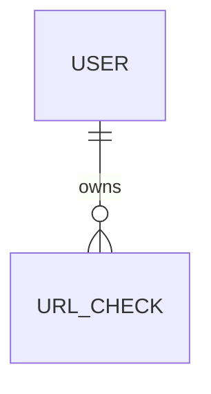

# Hidden Link Checker - Domain Model

## 1. Phạm vi MVP

MVP nhận một URL, lấy DOM của chính URL đầu vào, tìm hidden link và trả toàn bộ
kết quả **đồng bộ trong cùng một response**. Mọi URL được phát hiện đều là hidden
link; link hiển thị trực tiếp chỉ là một subtype có visibility `direct`. Hidden
link chỉ tồn tại trong phạm vi request đó; hệ thống chỉ lưu lại lịch sử URL đã
kiểm tra (`UrlCheck`), không lưu chi tiết hidden link sau khi đã phản hồi. MVP
không đánh giá rủi ro, không dùng severity/rule và không mở hoặc request tới
các link được phát hiện.

## 2. Quan hệ domain

## 3. Entity

### User

Đại diện tài khoản nội bộ liên kết với Google OAuth/OIDC.

Fields chính: `id`, `google_subject`, `email`, `status`, `created_at`,
`last_login_at`.

`google_subject` chỉ dùng nội bộ để liên kết identity, không trả qua public API.
Mọi dữ liệu kiểm tra phải được truy vấn theo authenticated `user_id`.

### UrlCheck

Đại diện việc user đã yêu cầu kiểm tra một URL. Đây là bản ghi lịch sử duy nhất
được lưu trữ lâu dài.

Fields chính: `id`, `user_id`, `url`, `checked_at`.

`UrlCheck` không lưu `status`, DOM, hay danh sách hidden link. Việc fetch/render
URL đầu vào và trích xuất hidden link diễn ra trong cùng vòng đời của một request
API và không có trạng thái trung gian cần theo dõi.

### LinkResult (giá trị tạm thời, không persist)

Đại diện một link được phát hiện trong DOM khi xử lý một request. `LinkResult`
chỉ tồn tại trong bộ nhớ trong lúc xử lý request và trong response trả về; nó
không có bảng lưu trữ và không có `id` ổn định qua các lần gọi khác nhau.

Fields chính: `element_type`, `object_reference`, `source_url`, `actual_url`,
`visibility`, `visible_text`, `alt_text`, `position`.

- `element_type`: `text`, `image` hoặc `background`.
- `visibility = direct`: hidden link hiển thị trực tiếp, ví dụ anchor có text.
- `visibility = indirect`: hidden link nằm sau image, background hoặc object
  không hiển thị như link trực tiếp.
- `source_url`: URL literal đọc được từ DOM.
- `actual_url`: URL sau khi resolve theo final URL của trang đầu vào.
- `position`: bounding box nếu lấy được, có thể `null`.

`actual_url` chỉ là dữ liệu kết quả. System không fetch, mở, redirect hoặc
điều hướng tới `actual_url` trong MVP, và không lưu lại `actual_url` sau khi
response đã được trả về (ngoài trường `url` gốc trong `UrlCheck`).

## 4. Invariants và ownership

1. Mỗi `UrlCheck` thuộc đúng một `User`.
2. Client không được tự gửi `user_id`; server lấy từ Google-authenticated user.
3. API phải lọc ownership trước mọi thao tác đọc hoặc xóa lịch sử.
4. Không lưu hoặc log OAuth secret, token, raw query string nhạy cảm, DOM đầy đủ
   hoặc danh sách `LinkResult` sau khi request kết thúc.
5. Xóa một `UrlCheck` chỉ xóa bản ghi lịch sử đó; không có dữ liệu con nào khác
   để dọn dẹp.

## 5. PostgreSQL mapping

PostgreSQL là database production chính, chỉ lưu lịch sử URL đã kiểm tra. Dùng
foreign key từ `url_checks.user_id` đến `users.id`.

Index tối thiểu:

- `users.google_subject` unique;
- `url_checks.user_id, checked_at` cho lịch sử.

Không có dữ liệu hidden link nào cần lưu dưới dạng JSONB hay bảng phụ; toàn bộ
`LinkResult` chỉ tồn tại trong response của request tương ứng.
